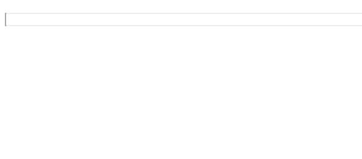

# Visual Studio Code Extension for Bookdown

This extension provides a few amenities for writing with bookdown, such as snippets, highlighting, rendering commands, and auto-completion of cross-references.

## Setup

This extension requires [R](https://www.r-project.org/) and the [bookdown package](https://github.com/rstudio/bookdown). 

By default, the extension will assume that the R binary is in the system path and can be launched either by `R.exe` on windows or `R` on Mac/Linux.
If this isn't the case, then the path to the R binary can be specified in the `Bookdown.R` configuration.  

## Features

### Code Snippets

A list of snippets is in `./snippets/bookdown.json`. Typing the prefix will typically cause the snippet suggestion to appear. If not, hit `Ctrl + Space` to trigger it and `Tab` to cycle through the different fields.

- Equations
    + Highlighting and snippets inside the math environment are provided by the [LaTeX-Workshop extension](https://github.com/James-Yu/LaTeX-Workshop)  


    

- Images
    + The preview for the image is provided by the [Markdown All in One extension](https://github.com/yzhang-gh/vscode-markdown)


- R code chunks
    - Highlighting and snippets inside the codeblock are provided by the [vscode R extension](https://github.com/Ikuyadeu/vscode-R) 
    


### Intellisense autocompletion for cross-references

Cross-references should show up when typing `\@ref()` or through the `\@` snippet. 
If it doesn't show up, then try `Ctrl + Space` to make the suggestion window pop up.


### Book rendering

A couple of commands are included for rendering a book. 
These commands will spawn a new terminal as well, which can be used to monitor the output from R.

**Tools for serving the book**

- `Bookdown.ServeBook` will call `bookdown::serve_book('.')` in R, and the book should show up in a new browser window. The browser will update whenever the book is edited/saved in vscode.
- `Bookdown.CloseBookServer` will close the book server but the R terminal will still keep running.
- `Bookdown.CloseTerminal` will close the R terminal.

**Tools for rendering the book**

The three commands are `Bookdown.RenderGitbook`, `Bookdown.RenderPDFbook`, and `Bookdown.RenderCustom`. 
The options for these commands are mentioned in the Configuration section below.

### Configuration

- `Bookdown.R`
    + Type: String, path to R binary, default: `""`  
    + Function: This is needed to launch R and to use the bookdown package. If it is left blank, then the extension will try to use either `R.exe` or `R` in the terminal to launch R.
- `Bookdown.ShowTerminal`  
    + Type: Boolean, default: `false`  
    + Function: If set to true, the terminal will be brought into focus whenever a command is sent to R  
- `Bookdown.ShowLog`
    + Type: Boolean, default: `false`
    + Function: If set to true, the extensions log will appear in the output panel for debugging
- `Bookdown.UseRmdFilesYAML`
    + Type: Boolean, default: `false`
    + Function: If false, intellisense will only suggest cross-references that are in the working document. If this config is set to true, then the extension will look in `_bookdown.yml` for the `rmd_files` entry and cross-references from all of those files will be shown by intellisense. 
- `Bookdown.Opts.Gitbook`
    + Type: String, default: `'index.Rmd','bookdown::gitbook'`
    + Function: This will be used as the input argument to `bookdown::render_book()` when rendering a gitbook.
- `Bookdown.Opts.PDFbook`
    + Type: String, default: `'index.Rmd','bookdown::pdfbook'`
    + Function: This will be used as the input argument to `bookdown::render_book()` when rendering a pdfbook.
- `Bookdown.Opts.Custom`
    + Type: Array
    + Function: This allows any arbitrary output as long as it is supported by bookdown.
    + The default configuration includes settings for an HTML and DOCX document output
    ```
    [
        {
            "name": "HTML Book",
            "opts": "'index.Rmd','bookdown::html_document2'"
        },
        {
            "name": "DOCX Book",
            "opts": "'index.Rmd','bookdown::word_document2'"
        }
    ]
    ```

## Acknowledgements

- The code for autocompleting cross-references was based on the [LaTeX-Workshop extension](https://github.com/James-Yu/LaTeX-Workshop)
- The syntax injection is adapted from the [vscode-fenced-code-block-grammar-injection-example](https://github.com/mjbvz/vscode-fenced-code-block-grammar-injection-example)
- Highlighting of code in R chunks requires the [vscode R extension](https://github.com/Ikuyadeu/vscode-R) 
- Hightlighting and snippets inside TeX-Math requires the [LaTeX-Workshop extension](https://github.com/James-Yu/LaTeX-Workshop)
